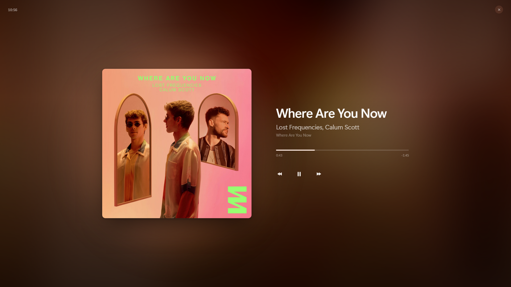
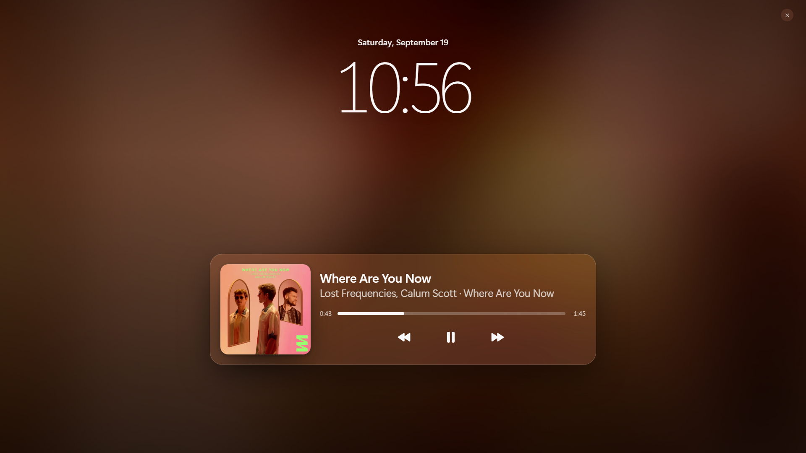
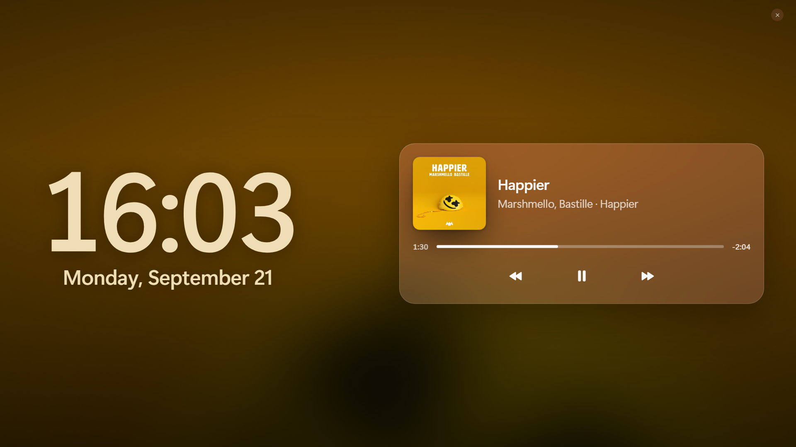
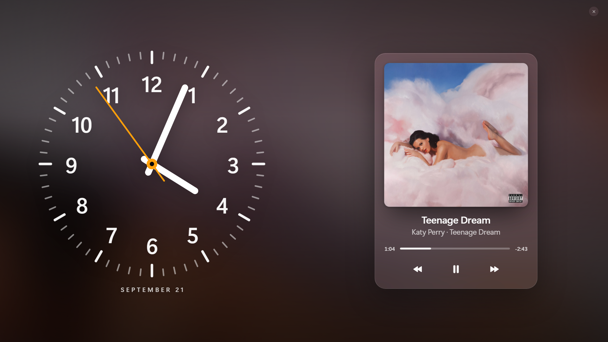

# Now Playing

A full-screen now-playing display for Spotify on Windows. It lives in the system tray; click the icon and the current track fills the screen.

Works out of the box with no sign-in - it reads the same Windows media session that powers the volume-key overlay. Optionally connect a Spotify account for reliable seeking and Spotify's own artwork.

## Themes

Four layouts, switchable live from Settings. All share the same backdrop options and the same playback state, so switching is instant.

| | |
| --- | --- |
| **Classic** - big cover, landscape | **Lock Screen** - date, clock, glass card |
|  |  |
| **Split** - clock left, card right | **Dial** - analogue clock, tall card |
|  |  |

### Backgrounds

| Option | Description |
| --- | --- |
| **Blurred cover** (default) | The album art, zoomed and blurred, at full strength. |
| **Solid colour** | A flat colour of your choosing. |
| **Album hues** | Three soft colour fields drawn from the cover, drifting slowly past each other. |
| **Image** | A picture of your own. |

### Fonts

Any font installed on the PC, or import a `.ttf`, `.otf`, `.ttc`, `.woff` or `.woff2` file. Imported fonts are copied into the app's data folder, so the original can be moved or deleted afterwards.

## Playback sources

| Source | Setup | Notes |
| --- | --- | --- |
| **System** (default on Windows) | None | Reads the Windows media session. Artwork is upgraded via the iTunes catalogue, since Windows only provides a small thumbnail. Seek availability depends on the Spotify build. Windows only. |
| **Spotify account** | One-time browser sign-in | Reads the Spotify Web API directly. Reliable seek, covers straight from Spotify. Transport controls require Spotify Premium (a Spotify restriction). |

On macOS and Linux only the Spotify account source is available. Switch between them from the tray menu or Settings. Choosing *Spotify account* opens Spotify's consent page in your browser; approve it and you're connected. Sign-in uses OAuth with PKCE and requests only the three scopes the display needs: `user-read-playback-state`, `user-modify-playback-state`, `user-read-currently-playing`. Tokens are stored locally and refreshed silently. **Disconnect** removes them.

## Controls

| Action | How |
| --- | --- |
| Open | Click the tray icon |
| Close | `Esc`, or the ✕ top-right |
| Play / pause | `Space`, or the centre button |
| Next / previous | `N` / `P`, or the side buttons |
| Seek ±5s | `←` / `→` |
| Scrub | Drag the progress bar |

The controls and close button fade after a few seconds of stillness and return on mouse movement. The clock stays.

## Install

**Requirements:** Windows 10/11, macOS, or Linux; the Spotify desktop app; Node.js 18+ to build.

```powershell
git clone https://github.com/Stoobyy/spotifs.git
cd spotifs
npm install
npm start
```

The app starts hidden — look for the tray icon (menu bar on macOS). To build an installer for the current platform — NSIS on Windows, DMG on macOS, AppImage on Linux:

```powershell
npm run dist
```

On GNOME the tray icon needs the AppIndicator extension.

## How it works

```
Spotify ──▶ Windows media session ──▶ PowerShell/WinRT bridge ──┐
                                                                ├──▶ Electron main ──▶ Renderer
Spotify ──▶ Web API (/me/player) ──▶ Spotify provider ──────────┘
```

- **`src/main/smtc-bridge.ps1`** - one long-lived PowerShell process that polls the Windows media session and emits a JSON line whenever something changes. No native Node addon, so `npm install` never needs a compiler.
- **`src/main/spotify.js`** - the Web API provider: PKCE sign-in with a loopback redirect, token refresh, and polling at 1s while the player is visible, 5s when hidden.
- **`src/main/palette.js`** - extracts an accent and three wash hues from the cover in the main process.
- **`src/renderer/`** - the display. One set of elements, rearranged per theme by a `data-theme` attribute, so every theme shares one state path. Position is extrapolated between updates so the progress bar moves smoothly.

Background motion is transform-and-opacity only, composited on the GPU, so it costs nothing on the CPU per frame.

## Troubleshooting

**1. "Nothing playing" while Spotify is playing.** 
Windows only exposes a session once something has been played - press play in Spotify once. If Spotify doesn't appear in the volume-key overlay, the OS isn't seeing it either.

**2. Seeking does nothing.** 
Some Spotify builds don't expose position control through the system session. Switch to the Spotify account source, which seeks reliably.

**3. Spotify controls do nothing but the track shows.** 
Playback control through the Web API requires Spotify Premium. Reading what's playing does not.

**4. Spotify sign-in reports the port is in use.** 
Something else is listening on the local callback port. Close it and try again.

**5. An imported font does nothing.** 
The importer checks the file extension, not the contents; a mis-named file is accepted and then fails to load. Confirm it opens in another app.
